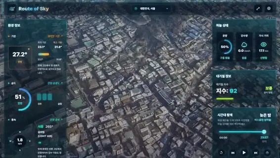
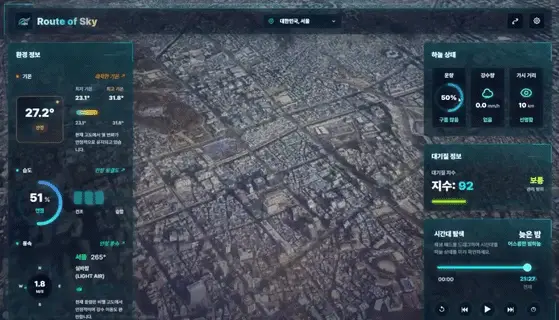
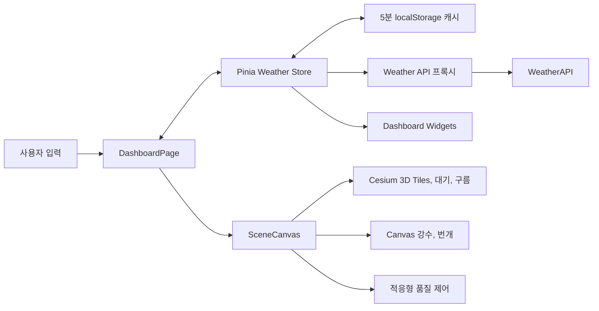

<div align="center">
  
  <h1>Route of Sky</h1>
  <p><strong>실시간 날씨를 세계 도시의 3D 하늘과 대기 효과로 변환하는 인터랙티브 시뮬레이터</strong></p>

  <p>
    
    
    
    
    
    
  </p>

  <p>
    <a href="https://routeofsky.vercel.app/"><strong>Live Demo</strong></a>
    ·
    <a href="docs/performance/case-study.md"><strong>Performance Case Study</strong></a>
    ·
    <a href="docs/study/01-project-structure.md"><strong>Architecture Notes</strong></a>
  </p>
</div>

---

## 프로젝트 소개

Route of Sky는 Cesium과 Google Photorealistic 3D Tiles 위에 실제 날씨, 지역별 현지 시각, 대기 상태를 결합한 Vue 3 대시보드입니다. 사용자는 10개 도시의 랜드마크로 이동하고, 현재 날씨를 확인하거나 Weather Lab에서 비·눈·폭풍·안개를 직접 시뮬레이션할 수 있습니다.

이 프로젝트는 화려한 3D 표현뿐 아니라 다음 문제를 함께 다룹니다.

- 서버 프록시를 통한 WeatherAPI 키 보호와 허용 지역 검증
- 5분 캐시, 중복 요청 병합, 요청 취소, 만료 캐시 fallback을 포함한 날씨 동기화
- Canvas 강수·번개, Cesium 구름·대기·후처리를 결합한 날씨 렌더링
- Auto/High/Medium/Low 품질 프로필과 실제 프레임 p95 기반 적응형 품질 제어
- 단위 테스트, E2E, 성능 예산과 실제 GPU 측정을 통한 회귀 방지

## 미리보기

<div align="center">
  
  <br />
  
</div>

## 주요 기능

### 세계 도시와 3D 카메라

- 서울, 뉴욕, 도쿄, 예루살렘, 런던, 파리, 베를린, 시드니, 리우데자네이루, 아그라 프리셋
- 도시별 랜드마크를 보여 주는 카메라 위치·방향 설정
- Cesium ion 토큰이 있으면 Google Photorealistic 3D Tiles를 로드하고, 없으면 설정 안내를 표시

### 실시간 날씨 동기화

- WeatherAPI의 현재 기온, 최저·최고 기온, 습도, 풍속·풍향, 운량, 강수량, 가시거리, PM2.5 기반 AQI 표시
- 브라우저에는 API 키를 노출하지 않고 로컬 Vite 프록시 또는 Vercel 서버리스 함수로 요청
- 지역별 5분 캐시와 만료 캐시 fallback, 수동 강제 새로고침, 실패 후 재시도 지원
- 빠른 지역 전환 시 이전 요청을 취소하고 최신 지역 응답만 반영

### 시간과 날씨 시뮬레이션

- 도시별 UTC offset을 반영한 현지 시간과 새벽·정오·일몰·밤 프리셋
- 태양 위치, 배경색, 대기 산란, 안개, 가시거리의 연동
- 비·눈 Canvas 파티클, 강풍 streak, 번개, Cesium 구름과 날씨 후처리
- 맑음·비·폭풍우·눈·안개 프리셋과 세부 수치 수동 조절

### 품질과 상태 복원

- Auto/High/Medium/Low 렌더링 품질 선택
- 프레임 p95에 따른 Auto 품질 조절과 품질별 해상도·파티클·구름·후처리 설정
- 선택 지역과 품질 설정을 `localStorage`에 저장하고 새로고침 후 복원
- 모바일에서 대시보드를 접고, 데스크톱 너비로 복귀하면 자동으로 다시 표시

## 동작 구조



- 개발 환경에서는 Vite가 `/api/weather`를 WeatherAPI로 프록시합니다.
- Vercel 배포에서는 `api/weather.js`가 요청 좌표를 검증하고 서버 전용 키로 upstream을 호출합니다.
- Pinia store는 fresh cache를 우선 사용하고, 네트워크 오류 시 만료 캐시가 있으면 화면을 유지합니다.
- 같은 날씨 상태가 대시보드와 Cesium/Canvas 렌더러에 전달되어 수치와 장면을 동기화합니다.

## 기술 스택

| 영역      | 기술                                     | 역할                                              |
| --------- | ---------------------------------------- | ------------------------------------------------- |
| UI        | Vue 3, TypeScript                        | Composition API 기반 화면과 타입 안전한 상태 흐름 |
| 상태 관리 | Pinia                                    | 날씨 요청, 캐시, 오류, 시뮬레이션 상태 관리       |
| 3D 렌더링 | CesiumJS, Google Photorealistic 3D Tiles | 도시 지형, 카메라, 태양, 대기와 구름 표현         |
| 시각 효과 | Canvas 2D, Cesium PostProcessStage, GSAP | 강수·번개·날씨 색보정과 UI 모션                   |
| 스타일    | Tailwind CSS 4, Sass                     | 반응형 대시보드와 시각 시스템                     |
| 빌드      | Vite 8, vue-tsc                          | 개발 서버, 타입 검사와 프로덕션 번들              |
| 품질      | Vitest, Vue Test Utils, Playwright       | 단위·컴포넌트·E2E 검증                            |
| 배포      | Vercel Functions                         | WeatherAPI 서버 프록시와 정적 앱 배포             |

## 빠른 시작

### 요구사항

- Node.js 20 이상
- pnpm 10

### 설치

```bash
git clone https://github.com/kangdy25/Route_of_Sky.git
cd Route_of_Sky
pnpm install
```

### 환경 변수

프로젝트 루트에 `.env` 파일을 만듭니다.

```env
WEATHER_API_KEY=your_weather_api_key
VITE_CESIUM_ION_ACCESS_TOKEN=your_cesium_ion_access_token
```

| 변수                           | 필수 여부                | 용도                                                                  |
| ------------------------------ | ------------------------ | --------------------------------------------------------------------- |
| `WEATHER_API_KEY`              | 실시간 날씨 사용 시 필수 | 로컬 Vite 프록시와 Vercel 서버리스 함수가 WeatherAPI를 호출할 때 사용 |
| `VITE_CESIUM_ION_ACCESS_TOKEN` | 선택                     | Cesium ion의 Google Photorealistic 3D Tiles를 로드할 때 사용          |

`WEATHER_API_KEY`는 서버 전용이므로 `VITE_` 접두사를 붙이지 않습니다. Cesium 토큰이 없어도 앱과 대시보드는 실행되지만 3D Tiles 대신 설정 안내가 표시됩니다.

### 실행

```bash
pnpm dev
```

개발 서버는 기본적으로 `http://localhost:5173`에서 실행됩니다.

## 프로젝트 구조

```text
.
├── api/                         # Vercel 서버리스 API와 성능 수집 endpoint
├── e2e/                         # Playwright 사용자 흐름 테스트
├── scripts/performance/         # 측정·비교·예산 검사 도구
├── src/
│   ├── pages/DashboardPage.vue  # 화면 조립과 지역·품질·날씨 흐름 연결
│   ├── widgets/dashboard/       # 헤더, 지표 패널, 시간·설정 UI
│   ├── features/scene/          # Cesium 장면, 카메라, 날씨 효과와 품질 제어
│   ├── features/weather/        # WeatherAPI 변환, Pinia store와 캐시
│   └── shared/                  # 환경 설정, 공통 UI와 유틸리티
├── docs/performance/            # 성능 원본, 비교표, 차트와 사례 연구
└── tests/                       # 서버 API 단위 테스트
```

## 테스트와 품질

2026-09-09 로컬 검증 기준:

| 항목                | 결과                    |
| ------------------- | ----------------------- |
| Vitest              | 36개 파일, 280/280 통과 |
| Playwright Chromium | 10/10 통과              |
| 라인 커버리지       | 95.0%                   |
| 프로덕션 빌드       | 성공                    |

```bash
pnpm test:unit
pnpm test:coverage
pnpm test:e2e
pnpm build
```

테스트 통과율과 코드 커버리지는 별도 지표입니다. 상세 커버리지는 `pnpm test:coverage`가 생성하는 V8 리포트에서 확인할 수 있습니다.

## 실행 스크립트

### 개발과 검증

| 명령어                   | 설명                                    |
| ------------------------ | --------------------------------------- |
| `pnpm dev`               | Vite 개발 서버 실행                     |
| `pnpm build`             | vue-tsc 타입 검사 후 프로덕션 빌드      |
| `pnpm preview`           | 프로덕션 빌드 로컬 미리보기             |
| `pnpm lint`              | ESLint 자동 수정 실행                   |
| `pnpm format`            | `src/`, `e2e/`에 Prettier 적용          |
| `pnpm test:unit`         | Vitest 전체 단발 실행                   |
| `pnpm test:coverage`     | V8 커버리지 리포트 생성                 |
| `pnpm test:e2e`          | Playwright Chromium E2E 실행            |
| `pnpm test:e2e:ui`       | Playwright UI 모드 실행                 |
| `pnpm test:e2e:report`   | 마지막 Playwright HTML 리포트 열기      |
| `pnpm test:perf-scripts` | 렌더 trace 분석 도구의 Node 테스트 실행 |

### 성능 측정

| 명령어                           | 설명                              |
| -------------------------------- | --------------------------------- |
| `pnpm perf:measure`              | 초기 로드와 API 관련 성능 측정    |
| `pnpm perf:gpu`                  | 실제 GPU 시나리오 측정            |
| `pnpm perf:gpu:compare`          | GPU 측정 결과 비교                |
| `pnpm perf:render-trace`         | 렌더링 trace 수집                 |
| `pnpm perf:render-trace:combine` | 반복 trace 측정 결과 결합         |
| `pnpm perf:compare`              | Before/After 결과 비교            |
| `pnpm perf:capture`              | 동일 조건의 시각 캡처 생성        |
| `pnpm perf:budget`               | JS·CSS·썸네일·배포 크기 예산 검사 |
