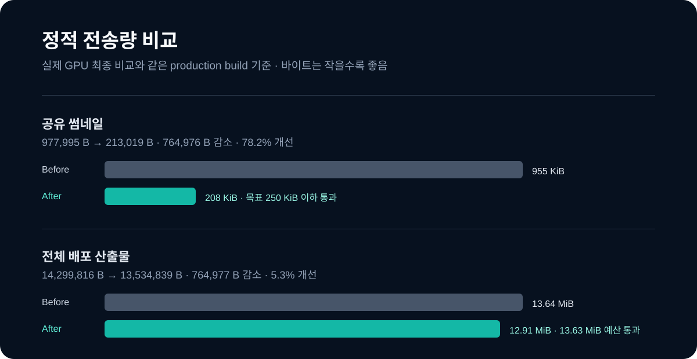
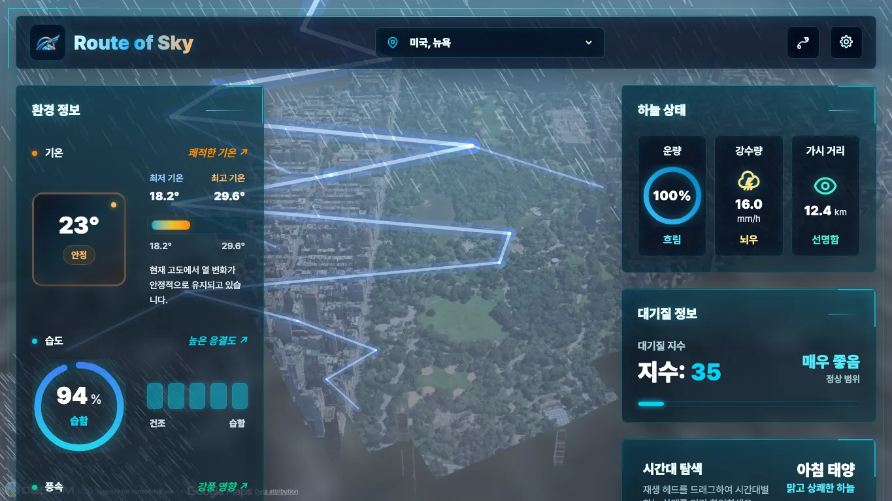
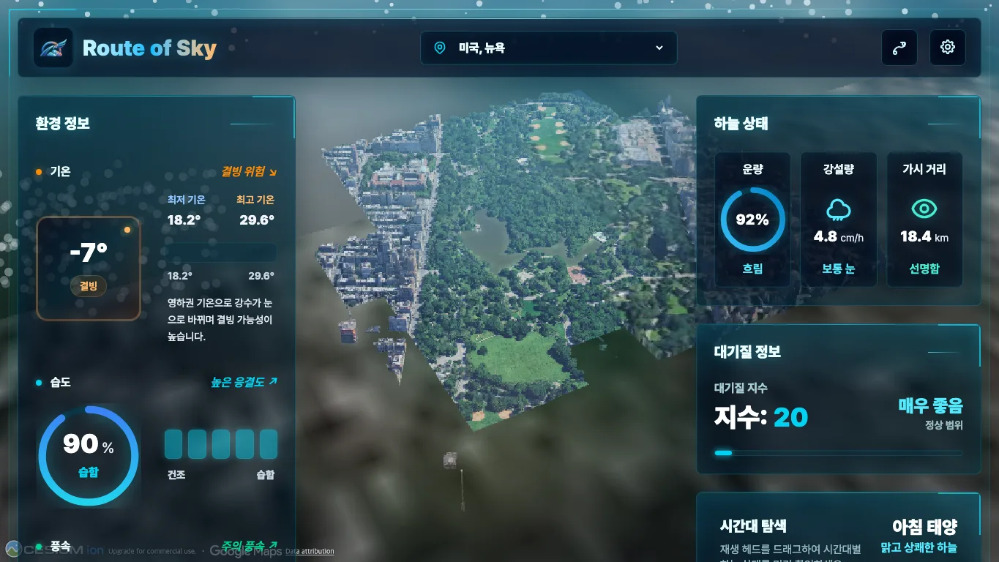

# Route of Sky 성능 최적화 사례 연구

## 요약

Route of Sky는 Cesium 3D 도시 장면 위에 실시간 날씨 대시보드와 Rain·Storm·Snow 효과를 함께 렌더링한다. 이 문서는 정적 전달, Weather API, 장면 품질, 실제 GPU 진단을 하나의 최적화 이력으로 설명한다.

핵심 원칙은 단순하다. **배포에 남은 변경만 성과로 기록하고, 실제 GPU에서 인과관계가 확정되지 않은 렌더링 실험은 성공으로 주장하지 않는다.**

| 사용자 문제 | 배포에 남긴 해결 | 정량 결과 | 판정 |
| --- | --- | --- | --- |
| 첫 방문에 큰 정적 파일을 받음 | 로고 WebP 전환, 런타임 미사용 데모 자산 분리, 썸네일 압축·정적 캐시 | 배포 산출물 **35.78 → 13.63MiB**, 로고 **3,872,089 → 5,154B**, 썸네일 **977,995 → 213,019B** | 적용·검증 완료 |
| 같은 날씨 데이터를 반복 요청 | 5분 localStorage 캐시, 동일 요청 병합, 이전 요청 취소, 강제 새로고침 우회 | 고정 시나리오 API 요청 **2 → 1건**, 50.0% 감소 | 적용·E2E 검증 완료 |
| 저사양 장치에서 날씨 효과가 무거움 | High/Medium/Low·Auto 품질, 선택 갱신, 실제 GPU trace로 재검증 | 단일 병목이 1.50× 기준에 미달 | 품질 저하 없이 추가 렌더링 변경 미적용 |

## 1. 사용자 경험을 기준으로 우선순위 정하기

초기 앱은 3D Tiles, 2D 날씨 입자, 후처리, 대시보드 DOM을 동시에 갱신했다. 체감 문제는 세 가지였다.

1. 첫 화면에 표시 크기보다 훨씬 큰 이미지와 런타임에서 쓰지 않는 자산이 포함됐다.
2. 같은 지역을 다시 보거나 새로고침해도 Weather API를 다시 호출했다.
3. 비·눈·폭풍과 3D 장면의 비용이 섞여 저사양 환경에서 어떤 경로를 고쳐야 할지 확정하기 어려웠다.

우선 정적 자산과 API 요청처럼 원인·효과가 분명하고 기능 위험이 낮은 작업을 적용했다. 렌더링은 품질을 낮추기 전에 실제 GPU 측정과 trace를 추가했다.

## 2. 정적 자산과 전달 최적화

### 변경

- 3,174px PNG 헤더 로고를 실제 표시 크기 128px WebP로 교체했다.
- 런타임에서 사용하지 않는 데모 GIF를 문서 자산으로 분리했다.
- 공유 썸네일을 시각 검증한 경량 이미지로 교체했다.
- `/thumbnail.jpg`와 `/cesium/*`에 `public, max-age=31536000, immutable` 캐시 정책을 추가했다.
- JS·CSS gzip, 전체 배포 크기, 썸네일 크기를 CI 성능 예산으로 검사한다.

### 결과

| 지표 | Before | After | 절대 차이 | 개선율 | 최종 판정 |
| --- | ---: | ---: | ---: | ---: | --- |
| 배포 산출물 | 35.78MiB | 13.63MiB | 22.16MiB 감소 | 61.9% | 적용 완료. 10MiB 목표는 미달 |
| 헤더 로고 | 3,872,089B | 5,154B | 3,866,935B 감소 | 99.9% | 통과 |
| 공유 썸네일 | 977,995B | 213,019B | 764,976B 감소 | 78.2% | 250KiB 이하 통과 |
| 앱 JS gzip | 86,752B | 86,752B | 0B | 0.0% | 90KiB 이하 통과 |
| 앱 CSS gzip | 14,950B | 14,947B | 3B 감소 | 0.0% | 18KiB 이하 통과 |

Cesium을 ESM으로 재빌드해 더 줄이는 실험도 했지만, 앱 JS gzip이 1,183.55KiB로 커져 초기 파싱 비용과 예산을 크게 초과했다. 이 실험은 채택하지 않았다. 현재의 배포 크기 13.63MiB도 10MiB 목표에는 미달하므로, Cesium Worker·텍스처를 근거 없이 삭제하지 않고 제약으로 공개한다.

## 3. Weather API 캐시와 요청 제어

### 변경

- 위도·경도를 정규화한 키로 5분 TTL localStorage 캐시를 저장한다.
- 유효 캐시는 즉시 화면에 반영한다.
- 같은 좌표의 동시 요청은 Promise 하나로 병합한다.
- 빠른 지역 전환에서는 이전 `AbortController` 요청을 취소해 늦은 응답이 현재 지역을 덮어쓰지 못하게 한다.
- “Render Current Weather”만 `force: true`로 캐시를 우회한다.
- 만료 캐시는 네트워크 오류 때만 복구값으로 사용하고 데이터 경과 시간을 표시한다.

### 결과와 데이터 신선도

| 지표 | Before | After | 절대 차이 | 개선율 | 최종 판정 |
| --- | ---: | ---: | ---: | ---: | --- |
| 고정 시나리오 API 네트워크 요청 | 2건 | 1건 | 1건 감소 | 50.0% | 통과 |
| 새로고침이 추가한 요청 | 1건 | 0건 | 1건 감소 | 100.0% | 통과 |
| 캐시 반영 p95 | 측정 불가 | 0.30ms | 측정 불가 | 측정 불가 | 100ms 이하 통과 |

공식 GPU 측정은 재현성을 위해 HTTP 캐시를 끄고 Weather 응답도 고정 mock으로 바꾼다. 이 통제 환경의 `2 → 2건`은 캐시 실패가 아니라 네트워크 조건을 고정한 결과다. 실제 재방문 0건과 강제 새로고침 우회는 Playwright 통합 테스트로 검증했다.

## 4. 렌더링 품질과 저사양 사용자 경험

### 배포에 남긴 품질 보호 장치

| 품질 | 해상도 | 날씨 FPS | 입자 | 구름 | 후처리 | 목적 |
| --- | ---: | ---: | ---: | ---: | --- | --- |
| High | 1.00 | 30 | 100% | 34 | 활성 | 기준 시각 품질 보존 |
| Medium | 0.85 | 24 | 70% | 22 | 활성 | 저사양에서 효과와 부하 균형 |
| Low | 0.70 | 20 | 45% | 12 | 비활성 | 최소 사양에서 기능 유지 |

Auto 모드는 5초 frame p95가 40ms를 넘으면 한 단계 낮추고, 10초 쿨다운 뒤 25ms 미만이 세 번 연속일 때만 다시 올린다. 사용자가 직접 선택한 품질은 localStorage에 보존된다. 씬 업데이트는 requestAnimationFrame으로 병합하고, 변경된 하위 시스템만 갱신하도록 했다.

### 렌더링 수치의 올바른 해석

초기 동일 환경 software WebGL 측정에서는 프레임 p95가 개선됐다. 예를 들어 데스크톱 Storm은 1,349.9 → 783.3ms, 저사양 Rain은 1,117.6 → 834.3ms였다. 다만 이 환경은 software renderer였으므로 실제 GPU의 절대 성능 수치로 사용하지 않았다.

실제 GPU Chrome에서 초기 로딩 분리와 rAF 렌더 루프 후보도 측정했다. 그러나 유지 조건을 충족하지 못해 코드를 롤백했다. 예를 들어 CPU ×4 Rain/Storm/Snow p95는 282.6/250.0/150.5ms에서 333.6/298.0/217.3ms로 악화돼, “개선”이라고 기록하지 않았다.

마지막 실제 GPU trace에서는 CPU ×4 Medium의 Composite와 JavaScript 비용 비율이 Rain 1.04×, Storm 1.04×, Snow 1.01×였다. 확정 기준인 1.50×에 미달해 단일 병목은 `unclassified`로 판정했다. 따라서 Canvas 입자, Cesium 상세도, Medium/Low 효과를 추정으로 추가 변경하지 않았다.

| 항목 | Before | After | 절대 차이 | 개선율 | 최종 판정 |
| --- | ---: | ---: | ---: | ---: | --- |
| 실제 GPU 렌더링 코드 | 실제 GPU 진단 전 상태 | 변경 없음 | 0 | 0.0% | 안전한 개선 미확정 |
| CPU ×4 Medium trace 병목 | Composite 우세처럼 보임 | JS와 1.01–1.05× 차이 | 확정 기준 미달 | 해당 없음 | `unclassified` |
| High 시각 품질 | 기준 프로필 | 변경 없음 | 해당 없음 | 해당 없음 | 통과 |

최종 재측정의 raw p95는 낮아졌지만, 그 사이 렌더링 런타임 코드는 0건 변경됐다. 따라서 이 수치 차이는 운영체제·브라우저 스케줄링·Cesium 타일 상태 변동으로 보존할 뿐, 최적화 성과로 귀속하지 않는다.

| High Storm | Medium Rain | Low Snow |
| --- | --- | --- |
|  |  |  |

## 5. 재현 가능한 검증 체계

- 실제 GPU 공식 수치는 non-headless Chrome, 1365×768, HTTP 캐시 비활성화, 동일 시나리오 3회 중앙값으로 기록한다.
- SwiftShader·llvmpipe·software renderer는 실제 GPU 공식 수치에서 제외한다.
- 저사양은 CPU 4배 제한을 별도로 기록한다.
- 원시 GPU 모델·드라이버, 위치, API 키, URL 쿼리, 식별자, 원시 trace는 문서·JSON·스크린샷에 저장하지 않는다.
- `perf:budget` CI는 JS gzip 90KiB, CSS gzip 18KiB, 썸네일 250KiB, 전체 배포 산출물 13.63MiB 이하를 차단한다.
- 단위 테스트 256개, Playwright E2E 7개, High/Medium/Low × Rain/Storm/Snow 시각 캡처로 기능·품질을 확인했다.

## 6. 최종 결론

완료한 최적화는 정적 전달과 API 요청처럼 인과관계가 검증된 영역에 남겼다. 반대로 렌더링은 실제 GPU 측정·trace를 도입했지만 공통 단일 병목을 확정하지 못했다. 그래서 품질을 희생하거나 기능 위험을 추가하는 최적화를 하지 않았다.

이 결정은 목표 미달을 숨기지 않고, “무엇을 빨라지게 했는지”와 “왜 더 건드리지 않았는지”를 모두 증명하는 결과다.

## 측정 원본과 의사결정 근거

- [전체 비교표](comparison.md): 적용한 변경과 롤백한 실험의 전·후 수치·판정
- [측정 프로토콜](measurement-protocol.md): software WebGL 이력과 실제 GPU 공식 기준의 구분
- [시간순 최적화 로그](optimization-log.md): 가설, 구현, 원본 수치, 롤백 조건
- [원본 실행 결과](runs/): 각 3회값과 중앙값을 보존한 JSON
- [시각 자료](assets/): 정적 전달량, 품질 검증, 전·후 캡처
- [통합 작업 일지](../worklogs/performance-optimization.md): 문서·원본 경로 통합 작업의 검증 기록

## PR 이력

| 범위 | PR | 결과 |
| --- | --- | --- |
| 최초 기준선·API 캐시·품질·정적 자산·사례 연구 | [#16–#20](https://github.com/kangdy25/Route_of_Sky/pulls?q=is%3Apr+is%3Aclosed+%28%2316+OR+%2317+OR+%2318+OR+%2319+OR+%2320%29) | 적용 |
| 실제 GPU 측정·초기 로딩/rAF 실험·정적 전달·예산 CI·최종 비교 | [#22–#27](https://github.com/kangdy25/Route_of_Sky/pulls?q=is%3Apr+is%3Aclosed+%28%2322+OR+%2323+OR+%2324+OR+%2325+OR+%2326+OR+%2327%29) | 정적 전달·CI 적용, 런타임 후보 롤백 |
| 작업 규칙·실제 GPU trace·최종 렌더링 판단·재측정 | [#28–#31](https://github.com/kangdy25/Route_of_Sky/pulls?q=is%3Apr+is%3Aclosed+%28%2328+OR+%2329+OR+%2330+OR+%2331%29) | 병목 미확정, 코드 변경 없음 |
