# Route of Sky 성능 최적화 사례 연구

## 한눈에 보는 결과

Route of Sky는 Google Photorealistic 3D Tiles 위에 실시간 날씨, 구름, 비·눈·폭풍 효과와 대시보드를 결합한 Vue 3 애플리케이션입니다. 기능 완성 뒤 실제 병목을 측정하고 API·렌더링·정적 자산을 독립 PR로 최적화했습니다.

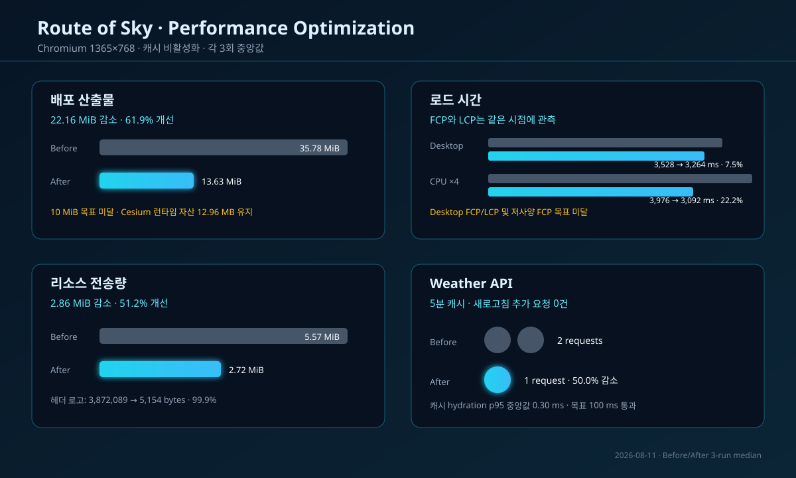

- 배포 산출물: 35.78 → 13.63 MiB, 22.16 MiB·61.9% 감소
- 데스크톱 Storm p95 프레임 시간: 1,349.9 → 783.3 ms, 566.6 ms·42.0% 개선
- 저사양 Rain p95 프레임 시간: 1,117.6 → 834.3 ms, 283.3 ms·25.3% 개선
- Weather API 네트워크 요청: 2 → 1건, 1건·50.0% 감소
- 헤더 로고: 3,872,089 → 5,154 bytes, 3,866,935 bytes·99.9% 감소

상대 성능은 전 지표에서 개선됐지만 배포 10 MiB, 데스크톱 FCP/LCP, 저사양 FCP, 절대 프레임 시간 목표는 달성하지 못했습니다. 미달 항목도 성공 수치와 같은 기준으로 공개합니다.

## 프로젝트 맥락과 사용자 문제

이 앱은 3D Tiles 렌더링과 2D 날씨 입자, 후처리, DOM 기반 대시보드를 동시에 갱신합니다. 초기 구현은 시각 품질과 기능 완성에 집중해 다음 문제가 남아 있었습니다.

1. 모든 상태 변경이 태양·대기·구름·후처리 전체 갱신을 유발했습니다.
2. 강한 비·폭풍·눈에서 고정된 입자 수와 해상도를 사용해 느린 장치도 같은 부하를 감당했습니다.
3. Weather API는 같은 지역 재진입과 새로고침 때도 매번 호출됐습니다.
4. 3,174px PNG 로고와 런타임 미사용 GIF 두 개가 public에 있어 배포 산출물이 35.78 MiB였습니다.

사용자 관점의 핵심 문제는 “날씨를 바꿀수록 화면 반응이 느려지고, 같은 데이터를 다시 기다리며, 첫 화면을 위해 불필요하게 큰 파일을 받는다”는 것이었습니다.

## 측정 원칙

- 프로덕션 빌드, Chromium 1365×768, HTTP 캐시 비활성화
- 데스크톱과 CPU 4배 제한 환경을 각각 3회 실행한 중앙값
- Rain, Storm, Snow를 각각 20초 실행해 rAF 간격 p95 수집
- Weather API는 동일한 고정 응답으로 대체해 외부 변동을 제거
- Google 3D Tiles는 실제 외부 서비스로 유지하되 단독 회귀 판정에 사용하지 않음
- 개선율: `(Before - After) / Before × 100`

세부 재현 방법은 [측정 프로토콜](measurement-protocol.md), 원본은 [Before JSON](runs/before.json)과 [After JSON](runs/after.json)에 보존했습니다.

## 병목 발견과 우선순위

### 1. 배포 자산

기준선 37,522,860 bytes 중 public의 로고와 GIF만 23,248,881 bytes였습니다. 코드 변경보다 위험이 낮고 개선 상한이 명확해 정적 자산을 높은 우선순위로 분류했습니다.

### 2. 중복 API 호출

고정 시나리오에서 초기 진입과 새로고침이 각각 Weather API를 호출해 총 2건이 발생했습니다. 동일 좌표·5분 이내 데이터는 사용자에게 의미 있는 신선도 차이가 없어 캐시 대상으로 판단했습니다.

### 3. 날씨 효과와 전체 씬 갱신

기준선 데스크톱 p95는 Rain 849.9 ms, Storm 1,349.9 ms, Snow 1,333.6 ms였습니다. 헤드리스 software WebGL이라는 제약을 감안해 절대 FPS보다 동일 환경의 상대 차이를 최적화 판단에 사용했습니다.

## 최적화 1 · Weather API 캐시와 요청 제어

좌표를 정규화한 키로 localStorage에 5분 TTL 캐시를 저장합니다. 유효 캐시는 즉시 화면에 반영하고, 같은 좌표의 동시 요청은 하나의 Promise로 병합합니다. 빠르게 지역을 바꾸면 이전 AbortController 요청을 취소해 늦은 응답이 최신 지역을 덮어쓰지 못하게 했습니다.

“Render Current Weather”는 사용자가 명시적으로 최신 데이터를 요구하는 동작이므로 `force: true`로 캐시를 우회합니다. 만료 데이터는 정상 흐름에서 사용하지 않고 네트워크 오류 때만 복구값으로 노출하며 데이터 경과 시간을 표시합니다.

결과는 총 요청 2 → 1건으로 50.0% 감소했고, 새로고침이 추가한 요청은 1 → 0건이 됐습니다. 캐시 hydration은 데스크톱 0.30 ms로 p95 100 ms 목표를 통과했습니다.

## 최적화 2 · 적응형 씬 품질과 선택 갱신

| 단계   | 해상도 | 날씨 FPS | 입자 | 구름 | 후처리 | 눈 효과    |
| ------ | -----: | -------: | ---: | ---: | ------ | ---------- |
| High   |   1.00 |       30 | 100% |   34 | 활성   | 그라데이션 |
| Medium |   0.85 |       24 |  70% |   22 | 활성   | 그라데이션 |
| Low    |   0.70 |       20 |  45% |   12 | 비활성 | 단색 원형  |

Auto 모드는 5초 구간의 p95 프레임 시간이 40 ms를 넘으면 한 단계 낮춥니다. 품질 진동을 막기 위해 10초 쿨다운을 두고, p95 25 ms 미만이 3구간 연속일 때만 한 단계 높입니다. 사용자가 High·Medium·Low를 직접 고르면 자동 전환을 중지하고 선택을 localStorage에 보존합니다.

씬 상태 변경은 한 requestAnimationFrame으로 병합했습니다. 시간·위치가 바뀔 때만 태양 시간을, 대기 관련 값이 바뀔 때만 안개와 대기를, 운량 관련 값이 바뀔 때만 구름을 갱신합니다. 구름의 Color와 Cartesian3는 재사용해 반복 할당도 줄였습니다.

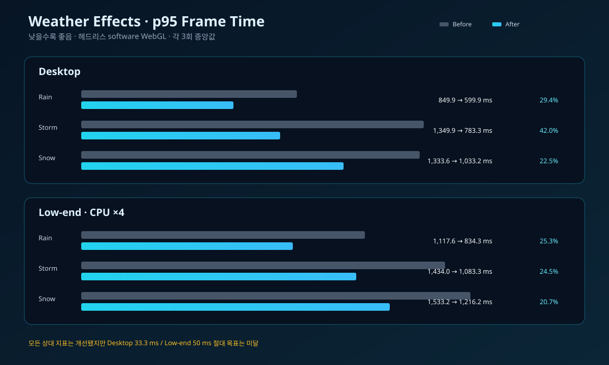

모든 날씨 프리셋의 상대 p95가 개선됐습니다. 다만 After도 데스크톱 599.9~1,033.2 ms, 저사양 834.3~1,216.2 ms로 절대 목표에는 미달했습니다. 이는 software WebGL에서 외부 3D Tiles와 rAF 자체가 크게 정체되는 측정 환경을 포함합니다. 실제 GPU RUM을 다음 검증 단계로 남겼습니다.

## 최적화 3 · 정적 자산

3,174×3,174 PNG 로고를 실제 표시 크기의 128×128 WebP로 바꿨습니다. 30초·28초 데모 GIF는 각각 재생 시간을 유지한 애니메이션 WebP로 변환해 docs로 이동했고 public 배포에서 제외했습니다.

Cesium의 ESM 재빌드도 실험했습니다. 배포 크기는 14,288,823 → 12,506,663 bytes로 12.5% 더 줄었지만 앱 JS gzip이 83.59 → 1,183.55KB로 1,315.9% 늘었습니다. 초기 다운로드·파싱 회귀와 90KB 목표 위반이 더 크다고 판단해 채택하지 않았습니다.

최종 배포 크기 13.63 MiB는 목표보다 3.63 MiB 큽니다. 남은 12.96MB는 Cesium 런타임, 좌표 변환, 텍스처, Worker 자산입니다. 실제 네트워크 요청과 시각 기능 검증 없이 이를 삭제하는 것은 위험해 미달을 수용하고 CDN 또는 선택 자산 배포를 후속 과제로 두었습니다.

## 정량 Before → After

| 지표                 |     Before |      After |      절대 차이 | 개선율 | 목표        |
| -------------------- | ---------: | ---------: | -------------: | -----: | ----------- |
| 배포 산출물          |  35.78 MiB |  13.63 MiB | 22.16 MiB 감소 |  61.9% | 미달        |
| 앱 JS gzip           |  77.79 KiB |  80.77 KiB |  2.98 KiB 증가 |  -3.8% | 통과        |
| CSS gzip             |  14.69 KiB |  14.74 KiB |  0.05 KiB 증가 |  -0.3% | 통과        |
| 데스크톱 FCP / LCP   |   3,528 ms |   3,264 ms |    264 ms 감소 |   7.5% | 미달 / 미달 |
| 저사양 FCP / LCP     |   3,976 ms |   3,092 ms |    884 ms 감소 |  22.2% | 미달 / 통과 |
| 데스크톱 Viewer 준비 |   557.7 ms |   496.2 ms |   61.5 ms 감소 |  11.0% | 통과        |
| 저사양 Viewer 준비   | 1,453.7 ms | 1,349.1 ms |  104.6 ms 감소 |   7.2% | 통과        |
| 데스크톱 Rain p95    |   849.9 ms |   599.9 ms |  250.0 ms 감소 |  29.4% | 미달        |
| 데스크톱 Storm p95   | 1,349.9 ms |   783.3 ms |  566.6 ms 감소 |  42.0% | 미달        |
| 데스크톱 Snow p95    | 1,333.6 ms | 1,033.2 ms |  300.4 ms 감소 |  22.5% | 미달        |
| 저사양 Rain p95      | 1,117.6 ms |   834.3 ms |  283.3 ms 감소 |  25.3% | 미달        |
| 저사양 Storm p95     | 1,434.0 ms | 1,083.3 ms |  350.7 ms 감소 |  24.5% | 미달        |
| 저사양 Snow p95      | 1,533.2 ms | 1,216.2 ms |  317.0 ms 감소 |  20.7% | 미달        |
| API 요청 수          |        2건 |        1건 |       1건 감소 |  50.0% | 통과        |
| 리소스 전송량        |   5.57 MiB |   2.72 MiB |  2.86 MiB 감소 |  51.2% | 관찰        |

전체 19개 지표와 목표 판정은 [개발자용 비교표](comparison.md)에서 확인할 수 있습니다.

## 동일 조건 시각 검증

| Before · Rain                                   | After · Rain                                   |
| ----------------------------------------------- | ---------------------------------------------- |
| 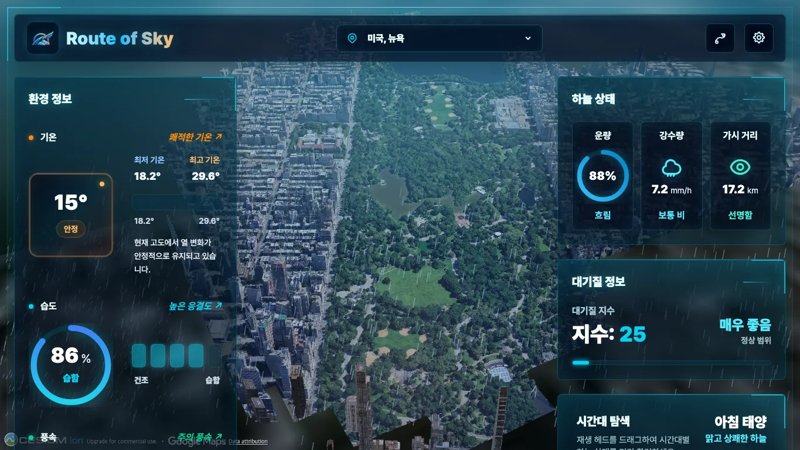 | 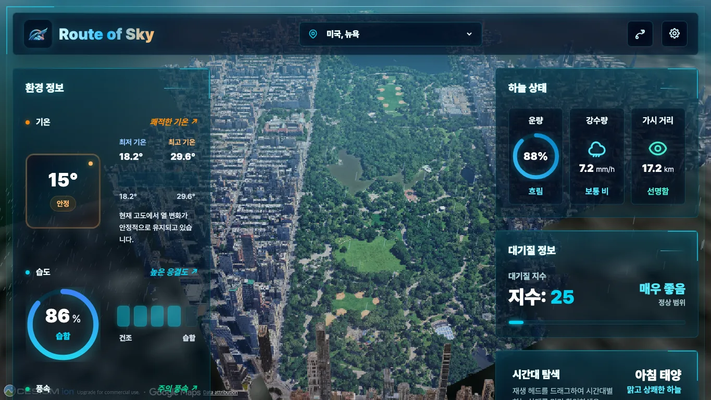 |

| 품질   | Rain                                                   | Storm                                                    | Snow                                                   |
| ------ | ------------------------------------------------------ | -------------------------------------------------------- | ------------------------------------------------------ |
| High   | 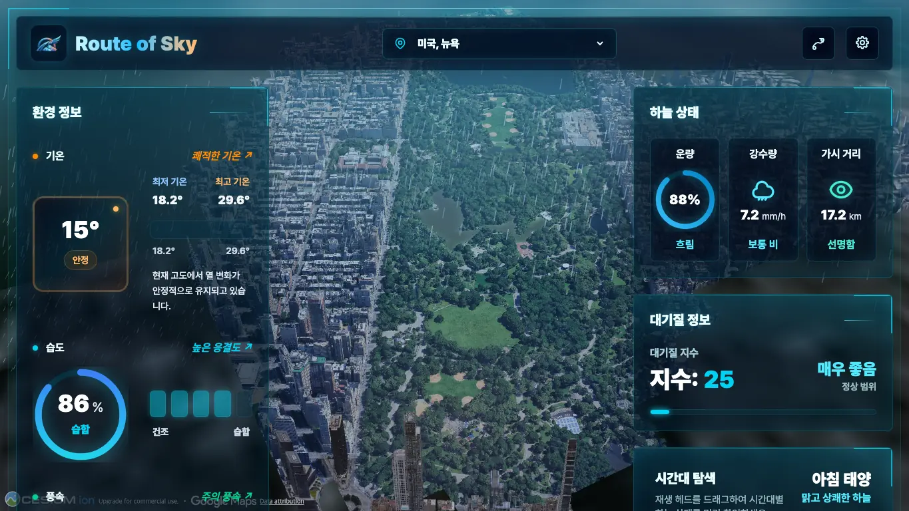     | 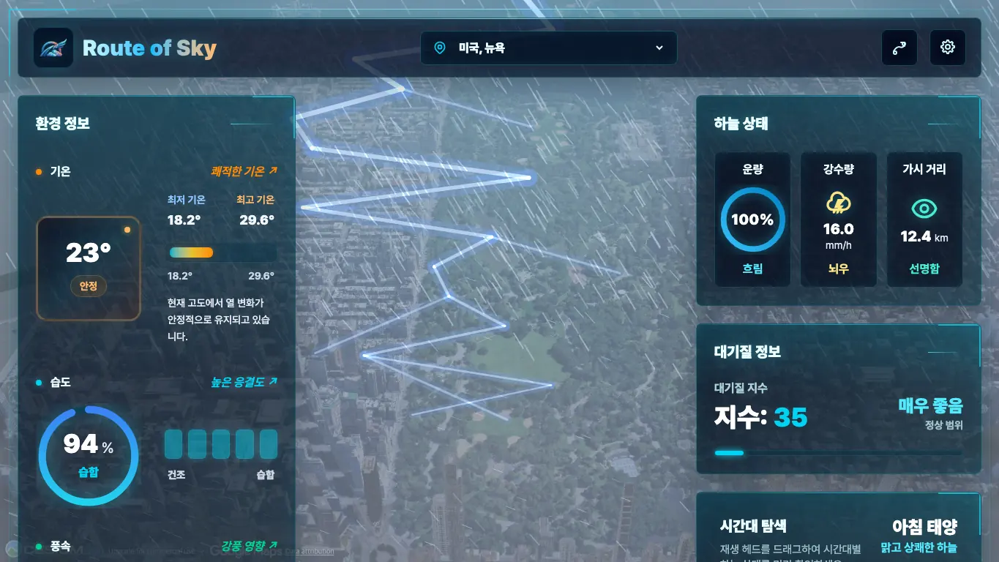     | 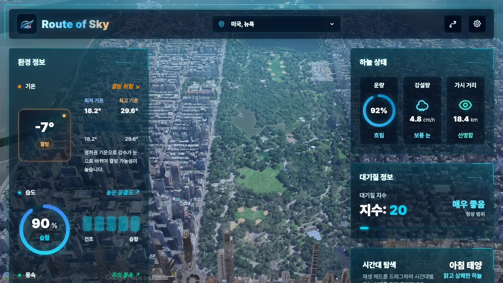     |
| Medium | 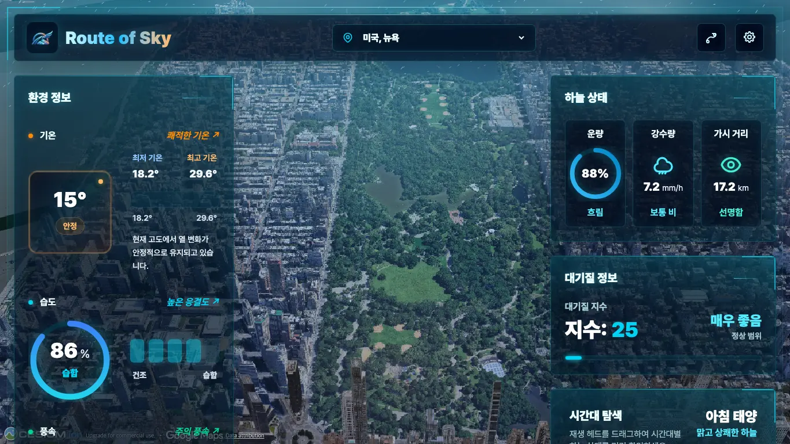 | 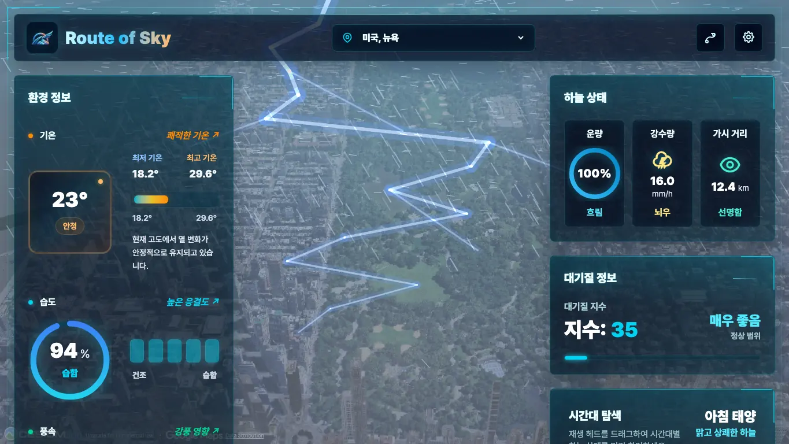 | 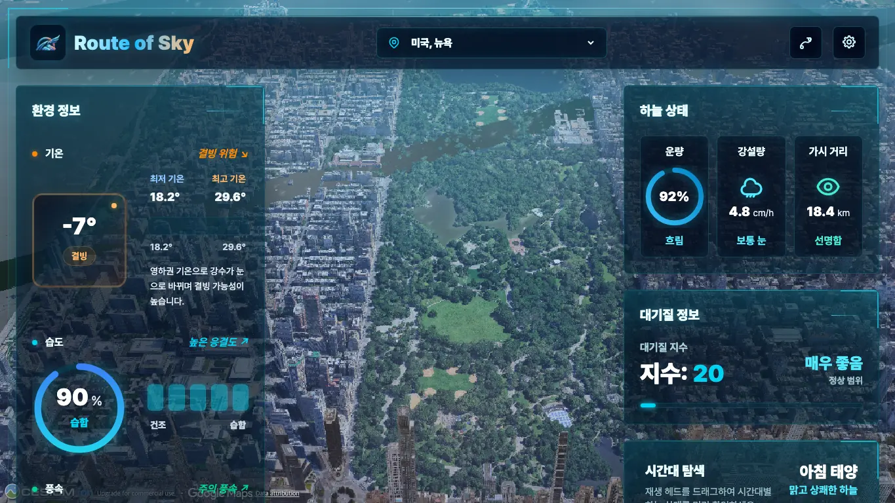 |
| Low    | 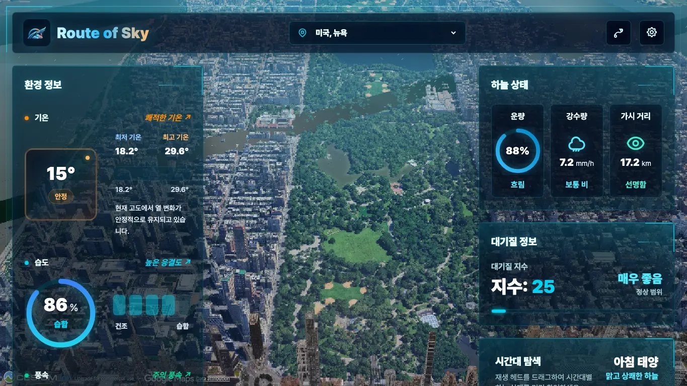       | 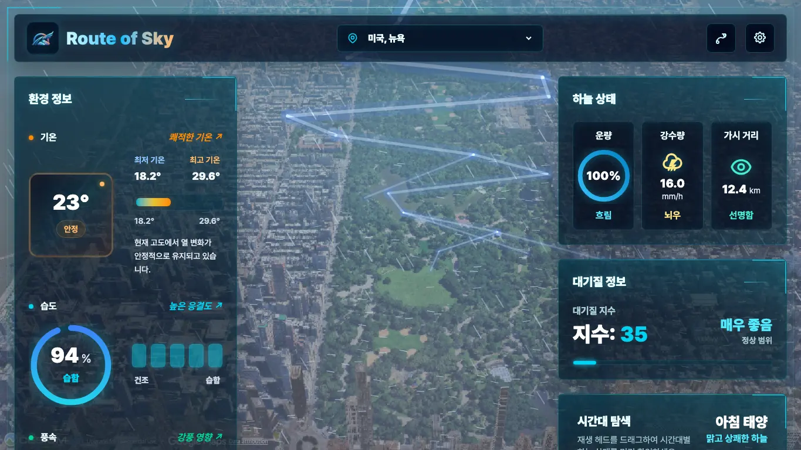       | 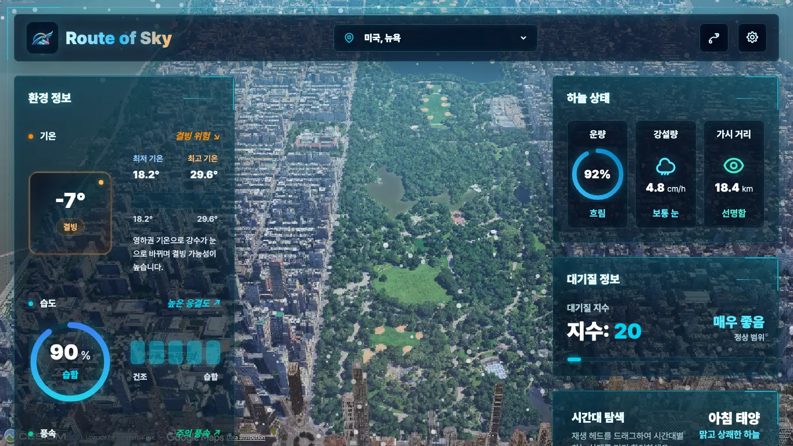       |

High·Medium·Low의 즉시 적용과 새로고침 복원은 E2E로 검증했습니다. 9개 캡처에서는 Rain·Storm·Snow가 모든 단계에서 유지되고 Low의 낮은 밀도, 후처리 제거, 단순 원형 눈 입자가 실제 화면에 반영되는지 확인했습니다.

## 제약, 실패와 다음 단계

- 데스크톱 FCP/LCP는 264 ms 개선됐지만 3,264 ms로 목표 미달입니다. 가장 긴 초기 long task와 외부 Cesium 전역 스크립트 분석이 다음 우선순위입니다.
- 저사양 FCP는 3,092 ms로 목표보다 292 ms 느립니다. LCP와 Viewer 준비는 통과했습니다.
- 프레임 절대값은 headless software WebGL에서 목표와 큰 차이가 납니다. 실제 GPU 장치의 PerformanceObserver/RUM p50·p95를 별도로 수집해야 합니다.
- 데스크톱 타일 안정화 이벤트는 세 번 모두 측정 구간에서 관측되지 않아 수치화하지 않았습니다. 저사양 타일 안정화 중앙값은 5,314.6 → 5,307.4 ms로 7.2 ms·0.1% 개선됐지만 외부 CDN 변동만으로 회귀를 판정하지 않았습니다.
- Weather API 네트워크 지연은 재현성을 위해 고정 응답으로 대체했습니다. 실제 공급자 p50·p95는 API 키를 노출하지 않는 운영 관측 환경에서 수집해야 합니다.

## 브랜치·PR·리뷰 기록

모든 변경은 최신 main에서 분기해 기능 단위 커밋, 푸시, 한국어 PR, 자체 리뷰 코멘트, CI·Vercel·CodeRabbit 검증, Merge commit 순서로 병합했습니다.

1. [PR #16 · 기준선 측정](https://github.com/kangdy25/Route_of_Sky/pull/16) — [5964a66](https://github.com/kangdy25/Route_of_Sky/commit/5964a66)
2. [PR #17 · Weather API 캐시](https://github.com/kangdy25/Route_of_Sky/pull/17) — [d91cf78](https://github.com/kangdy25/Route_of_Sky/commit/d91cf78), [211c9e7](https://github.com/kangdy25/Route_of_Sky/commit/211c9e7)
3. [PR #18 · 적응형 씬 품질](https://github.com/kangdy25/Route_of_Sky/pull/18) — [5aa37b0](https://github.com/kangdy25/Route_of_Sky/commit/5aa37b0), [0d09d87](https://github.com/kangdy25/Route_of_Sky/commit/0d09d87), [4cd1aa0](https://github.com/kangdy25/Route_of_Sky/commit/4cd1aa0)
4. [PR #19 · 정적 자산 최적화](https://github.com/kangdy25/Route_of_Sky/pull/19) — [1e45a64](https://github.com/kangdy25/Route_of_Sky/commit/1e45a64), [ac3a098](https://github.com/kangdy25/Route_of_Sky/commit/ac3a098), [08757f0](https://github.com/kangdy25/Route_of_Sky/commit/08757f0)
5. [PR #20 · 최종 비교와 사례 연구](https://github.com/kangdy25/Route_of_Sky/pull/20) — [b3f58ec](https://github.com/kangdy25/Route_of_Sky/commit/b3f58ec), [b061443](https://github.com/kangdy25/Route_of_Sky/commit/b061443), [d2e5245](https://github.com/kangdy25/Route_of_Sky/commit/d2e5245)

각 PR에는 테스트 결과와 정량 Before→After, 위험, 롤백 조건을 남겼습니다. 세부 의사결정의 시간순 기록은 [최적화 로그](optimization-log.md)에 있습니다.
