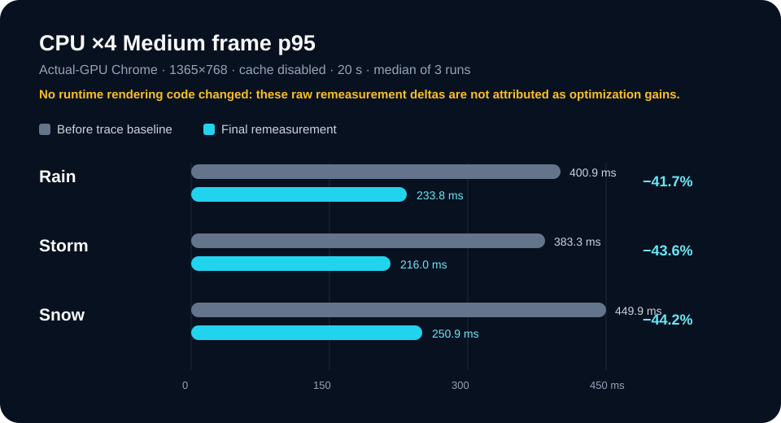

# Route of Sky 성능 최적화 전체 비교

모든 개선율은 `(Before - After) / Before × 100`으로 계산한다. 시간·용량·호출 수가 작아질수록 양수 개선율이다. 아래 표는 서로 다른 측정 환경을 합산하지 않으며, software WebGL의 초기 상대 비교와 실제 GPU의 공식 측정을 명확히 구분한다.

## 배포에 남은 정적 전달·API 개선

| 지표 | Before | After | 절대 차이 | 개선율 | 목표 판정 |
| --- | ---: | ---: | ---: | ---: | --- |
| 전체 배포 산출물 | 35.78MiB | 13.63MiB | 22.16MiB 감소 | 61.9% | 적용 완료, 10MiB 목표는 미달 |
| 헤더 로고 | 3,872,089B | 5,154B | 3,866,935B 감소 | 99.9% | 50KiB 이하 통과 |
| 공유 썸네일 | 977,995B | 213,019B | 764,976B 감소 | 78.2% | 250KiB 이하 통과 |
| 앱 JS gzip | 86,752B | 86,752B | 0B | 0.0% | 90KiB 이하 통과 |
| 앱 CSS gzip | 14,950B | 14,947B | 3B 감소 | 0.0% | 18KiB 이하 통과 |
| 같은 지역 API 네트워크 요청 | 2건 | 1건 | 1건 감소 | 50.0% | 통과 |
| 새로고침이 추가한 API 요청 | 1건 | 0건 | 1건 감소 | 100.0% | 통과 |
| Weather 캐시 반영 p95 | 측정 불가 | 0.30ms | 측정 불가 | 측정 불가 | 100ms 이하 통과 |

`/thumbnail.jpg`와 `/cesium/*`에는 `public, max-age=31536000, immutable`을 적용했다. 공식 GPU 측정은 HTTP 캐시를 의도적으로 비활성화하므로, 이 헤더의 재방문 이득은 해당 측정의 전송량 수치에 포함하지 않는다.

## 최초 상대 비교 — software WebGL 기록

아래는 초기 프로덕션 빌드·1365×768·HTTP 캐시 비활성화·3회 중앙값 기록이다. headless software WebGL은 실제 사용자 GPU보다 과도하게 느릴 수 있으므로 **프레임 절대값과 개선율을 실제 GPU 성과로 사용하지 않는다.** 정적 자산·API의 값은 동일 원본에서 확인할 수 있다.

| 지표 | Before | After | 절대 차이 | 개선율 | 목표 판정 |
| --- | ---: | ---: | ---: | ---: | --- |
| 데스크톱 FCP / LCP | 3,528.0ms | 3,264.0ms | 264.0ms 단축 | 7.5% | 미달 |
| 데스크톱 Viewer 준비 | 557.7ms | 496.2ms | 61.5ms 단축 | 11.0% | 통과 |
| 저사양 FCP / LCP | 3,976.0ms | 3,092.0ms | 884.0ms 단축 | 22.2% | LCP 통과 |
| 저사양 Viewer 준비 | 1,453.7ms | 1,349.1ms | 104.6ms 단축 | 7.2% | 통과 |
| 데스크톱 Rain / Storm / Snow p95 | 849.9 / 1,349.9 / 1,333.6ms | 599.9 / 783.3 / 1,033.2ms | 250.0 / 566.6 / 300.4ms 단축 | 29.4 / 42.0 / 22.5% | 절대 목표 미달 |
| 저사양 Rain / Storm / Snow p95 | 1,117.6 / 1,434.0 / 1,533.2ms | 834.3 / 1,083.3 / 1,216.2ms | 283.3 / 350.7 / 317.0ms 단축 | 25.3 / 24.5 / 20.7% | 절대 목표 미달 |

원본: [before.json](runs/before.json), [after.json](runs/after.json)

## 실제 GPU에서 롤백한 런타임 후보

공식 수치는 non-headless Chrome, 실제 GPU 가속, 1365×768, HTTP 캐시 비활성화, 고정 Weather mock, 동일 시나리오 3회 중앙값이다. SwiftShader·llvmpipe·software renderer는 결과를 저장하지 않고 실패 처리한다.

| 후보 | 지표 | Before | After | 절대 차이 | 개선율 | 최종 판정 |
| --- | --- | ---: | ---: | ---: | ---: | --- |
| SceneCanvas 지연 로딩 | 데스크톱 FCP / LCP | 692.0ms | 1,044.0 / 1,060.0ms | 352.0 / 368.0ms 증가 | -50.9 / -53.2% | 롤백 |
| SceneCanvas 지연 로딩 | 데스크톱 Viewer 준비 | 651.9ms | 1,408.6ms | 756.7ms 증가 | -116.1% | 롤백 |
| SceneCanvas 지연 로딩 | CPU ×4 FCP / LCP | 1,000.0ms | 1,240.0ms | 240.0ms 증가 | -24.0% | 롤백 |
| SceneCanvas 지연 로딩 | CPU ×4 Viewer 준비 | 1,927.6ms | 3,291.0ms | 1,363.4ms 증가 | -70.7% | 롤백 |
| rAF 강수 루프 | 데스크톱 Rain / Storm / Snow p95 | 83.4 / 66.7 / 17.7ms | 183.2 / 135.2 / 66.7ms | 99.8 / 68.5 / 49.0ms 증가 | -119.7 / -102.7 / -276.8% | 롤백 |
| rAF 강수 루프 | CPU ×4 Rain / Storm / Snow p95 | 300.2 / 266.9 / 200.8ms | 434.7 / 431.4 / 432.1ms | 134.5 / 164.5 / 231.3ms 증가 | -44.8 / -61.6 / -115.2% | 롤백 |

두 후보는 각각 초기 표시 또는 프레임 p95의 유지 조건을 충족하지 못했고, 다른 프리셋의 5% 회귀 한도도 넘었다. 구현 코드는 병합 전에 되돌렸으므로 현재 성과에 포함하지 않는다. 원본: [initial-load-before/after](runs/), [render-loop-before/after](runs/)

## 실제 GPU 최종 관측 — 인과적 성과 아님

정적 전달·캐시 정책이 반영된 최신 상태의 독립 3회 측정은 아래와 같았다. 초기 로딩·rAF 후보는 이미 롤백됐으므로 런타임 수치의 차이를 정적 작업의 비용이나 이득으로 단정하지 않는다.

| 지표 | Before | After | 절대 차이 | 개선율 | 목표 판정 |
| --- | ---: | ---: | ---: | ---: | --- |
| 전체 배포 산출물 | 14,299,816B | 13,534,839B | 764,977B 감소 | 5.3% | 13.63MiB 이하 통과 |
| 데스크톱 FCP / LCP | 640.0ms | 732.0ms | 92.0ms 증가 | -14.4% | 관측상 미달, 개선 주장 안 함 |
| 데스크톱 Viewer 준비 | 669.0ms | 794.1ms | 125.1ms 증가 | -18.7% | 관측상 미달, 개선 주장 안 함 |
| CPU ×4 FCP / LCP | 940.0ms | 1,060.0ms | 120.0ms 증가 | -12.8% | 관측상 미달, 개선 주장 안 함 |
| CPU ×4 Viewer 준비 | 1,588.0ms | 2,078.1ms | 490.1ms 증가 | -30.9% | 관측상 미달, 개선 주장 안 함 |
| CPU ×4 Rain / Storm / Snow p95 | 282.6 / 250.0 / 150.5ms | 333.6 / 298.0 / 217.3ms | 51.0 / 48.0 / 66.8ms 증가 | -18.0 / -19.2 / -44.4% | 관측상 미달, 후보 롤백 |
| 데스크톱 Long Task p95 | 104.0ms | 85.0ms | 19.0ms 단축 | 18.3% | 관측값만 보존 |

원본: [gpu-baseline-before.json](runs/gpu-baseline-before.json), [gpu-final-after.json](runs/gpu-final-after.json)

## 실제 GPU trace와 마지막 렌더링 판단

CPU ×4·Medium·20초·3회 조건에서 모든 프리셋은 Composite가 최대 집계였지만 JavaScript 대비 1.01–1.05×였다. 확정 규칙인 1.50×에 미달해 `unclassified`로 판정했고, Canvas·Paint/Raster·Cesium 중 어느 경로도 임의로 변경하지 않았다.

| 프리셋 | trace 최대 / 두 번째 비용 | 비율 | 확정 기준 | 판정 |
| --- | --- | ---: | --- | --- |
| Rain | Composite / JavaScript | 1.04× | 1.50× 이상 | `unclassified` |
| Storm | Composite / JavaScript | 1.04× | 1.50× 이상 | `unclassified` |
| Snow | Composite / JavaScript | 1.01× | 1.50× 이상 | `unclassified` |

마지막 재측정의 raw 프레임 p95는 아래처럼 낮아졌지만, 두 측정 사이 런타임 코드는 0건 변경됐다. 따라서 수치 차이를 최적화 성공으로 표시하지 않는다.

| CPU ×4 Medium | Before 3회 → 중앙값 | After 3회 → 중앙값 | 절대 차이 | raw 개선율 | 최종 판정 |
| --- | ---: | ---: | ---: | ---: | --- |
| Rain | 417.5 / 400.9 / 400.0ms → 400.9ms | 249.0 / 165.9 / 233.8ms → 233.8ms | 167.1ms 단축 | 41.7% | 코드 변경 없음, 인과적 개선 아님 |
| Storm | 383.3 / 383.2 / 500.0ms → 383.3ms | 299.4 / 117.3 / 216.0ms → 216.0ms | 167.3ms 단축 | 43.6% | 코드 변경 없음, 인과적 개선 아님 |
| Snow | 449.9 / 533.3 / 383.4ms → 449.9ms | 250.0 / 300.0 / 250.9ms → 250.9ms | 199.0ms 단축 | 44.2% | 코드 변경 없음, 인과적 개선 아님 |

원본: [render-trace-after.json](runs/render-trace-after.json), [render-final-before.json](runs/render-final-before.json), [render-final-after.json](runs/render-final-after.json)
