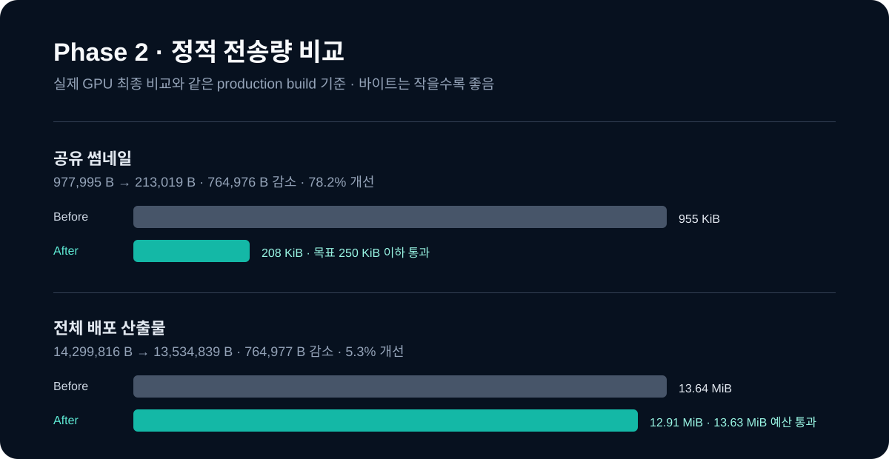

# Phase 2 최종 실제 GPU 성능 비교

기준선은 [`runs/real-gpu-before.json`](runs/real-gpu-before.json), 최종값은 [`runs/phase2-final-after.json`](runs/phase2-final-after.json)이다. 둘 다 로컬 Google Chrome의 실제 GPU 가속, 1365×768, HTTP 캐시 비활성화, 프리셋당 20초, 데스크톱과 CPU ×4 각각 3회 중앙값이다. 원시 GPU 모델·위치·API 키는 저장하지 않았다.

개선율은 `(Before - After) / Before × 100`이다. `After`는 정적 자산·캐시 정책·CI 게이트를 모두 병합한 최신 `main`에서 측정했다. 초기 로딩 분리(PR #23)와 rAF 렌더 루프(PR #24)는 유지 조건을 충족하지 못해 **구현을 롤백**했으므로, 아래 런타임 값의 불리한 차이를 그 두 변경의 비용 또는 개선으로 주장하지 않는다.

## 정적 전송량과 전달 정책

| 지표 | Before | After | 절대 차이 | 개선율 | 목표 | 판정 |
| --- | ---: | ---: | ---: | ---: | --- | --- |
| 전체 배포 산출물 | 14,299,816 B | 13,534,839 B | 764,977 B 감소 | 5.3% | 13.63 MiB 이하 | 통과 |
| 앱 entry JS gzip | 86,752 B | 86,752 B | 0 B | 0.0% | 90 KiB 이하 | 통과 |
| 앱 entry CSS gzip | 14,950 B | 14,947 B | 3 B 감소 | 0.0% | 18 KiB 이하 | 통과 |
| 공유 썸네일 | 977,995 B | 213,019 B | 764,976 B 감소 | 78.2% | 250 KiB 이하 | 통과 |
| `/thumbnail.jpg`·`/cesium/*` Cache-Control | 명시 정책 없음 | `public, max-age=31536000, immutable` | 정책 추가 | 해당 없음 | 버전 안전 장기 캐시 | 통과 |

Production 공개 URL의 2026-08-13 HEAD 응답에서 썸네일(213,019 B)과 Cesium Worker 모두 위 immutable 헤더를 확인했다. 이 헤더는 같은 버전 재방문에서 Cesium 정적 파일을 브라우저 캐시로 재사용하게 하지만, HTTP 캐시를 의도적으로 끈 공식 GPU 측정의 리소스 전송량에는 반영되지 않는다.

## 실제 GPU 런타임 관측값

| 지표 | Before | After | 절대 차이 | 개선율 | 목표 | 판정 |
| --- | ---: | ---: | ---: | ---: | --- | --- |
| 데스크톱 FCP / LCP | 640.0 / 640.0 ms | 732.0 / 732.0 ms | 92.0 ms 증가 | -14.4% | 기준선 대비 10% 개선 | 미달 |
| 데스크톱 CLS | 0.0000 | 0.0000 | 0.0000 | 계산 불가 | 0.02 이하 | 통과 |
| 데스크톱 Viewer 준비 | 669.0 ms | 794.1 ms | 125.1 ms 증가 | -18.7% | 악화 15% 이하 | 미달 |
| 데스크톱 Long Task p95 | 104.0 ms | 85.0 ms | 19.0 ms 단축 | 18.3% | 기준선 대비 개선 | 통과 |
| 데스크톱 Event Timing p95 | 152.0 ms | 168.0 ms | 16.0 ms 증가 | -10.5% | 기준선 대비 개선 | 미달 |
| 데스크톱 Rain / Storm / Snow p95 | 67.4 / 50.1 / 17.6 ms | 98.0 / 66.6 / 18.7 ms | 30.6 / 16.5 / 1.1 ms 증가 | -45.4 / -32.9 / -6.2% | 각 15% 개선, 5% 초과 회귀 금지 | 미달 |
| CPU ×4 FCP / LCP | 940.0 / 940.0 ms | 1,060.0 / 1,060.0 ms | 120.0 ms 증가 | -12.8% | 기준선 대비 개선 | 미달 |
| CPU ×4 Viewer 준비 | 1,588.0 ms | 2,078.1 ms | 490.1 ms 증가 | -30.9% | 악화 15% 이하 | 미달 |
| CPU ×4 Long Task p95 | 259.0 ms | 311.0 ms | 52.0 ms 증가 | -20.1% | 기준선 대비 개선 | 미달 |
| CPU ×4 Event Timing p95 | 344.0 ms | 376.0 ms | 32.0 ms 증가 | -9.3% | 기준선 대비 개선 | 미달 |
| CPU ×4 Rain / Storm / Snow p95 | 282.6 / 250.0 / 150.5 ms | 333.6 / 298.0 / 217.3 ms | 51.0 / 48.0 / 66.8 ms 증가 | -18.0 / -19.2 / -44.4% | 각 15% 개선, 5% 초과 회귀 금지 | 미달 |

이 값은 서로 다른 시간대의 독립 3회 배치라 GPU 부하·OS 스케줄링·Cesium 초기화 변동을 포함한다. 현재 `main`에는 Phase 2 렌더링 실험 코드가 존재하지 않고 정적 전달 변경만 남아 있으므로, 런타임 표는 **개선 주장에 쓰지 않고 관측값과 미달 근거로 보존**한다. 이 원칙 때문에 목표를 맞추지 못한 두 실험은 코드 대신 실패 기록만 병합했다.

## API·품질·측정 한계

| 지표 | Before | After | 절대 차이 | 개선율 | 목표 | 판정 |
| --- | ---: | ---: | ---: | ---: | --- | --- |
| 캐시 비활성 측정의 API 네트워크 요청 | 2건 | 2건 | 0건 | 0.0% | 비교 통제 | 통과 |
| 데스크톱 캐시 반영 | 0.3 ms | 0.2 ms | 0.1 ms 단축 | 33.3% | p95 100ms 이하 | 통과 |
| CPU ×4 캐시 반영 | 1.2 ms | 1.2 ms | 0.0 ms | 0.0% | p95 100ms 이하 | 통과 |
| 품질 적용 횟수(Desktop / CPU ×4) | 4 / 3회 | 4 / 3회 | 0회 | 0.0% | 단계 전환 관측 | 통과 |

공식 측정은 네트워크·브라우저 캐시를 끈 상태에서 Weather 응답을 고정 모킹한다. 따라서 `2 → 2건`은 Weather 5분 캐시의 실패가 아니라 비교 조건을 일정하게 하는 의도된 결과다. 실제 5분 캐시의 “재방문 API 0건”과 강제 새로고침 우회는 Playwright 통합 테스트에서 검증하며, 캐시 정책과 E2E 근거는 [Phase 1 사례 연구](../case-study.md)에 보존돼 있다. 외부 Google 3D Tiles·실제 Weather API 응답은 p50/p95 관찰 대상이지만 변동만으로 회귀를 판정하지 않는다.
