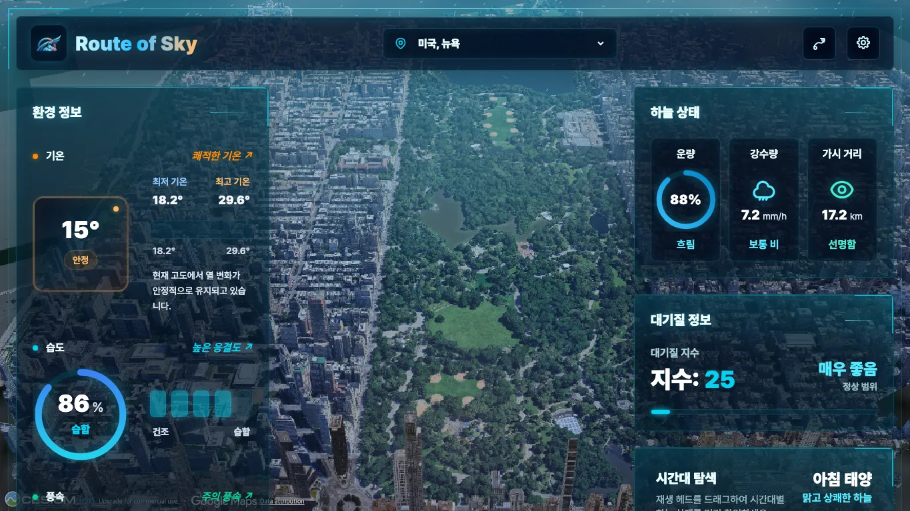

# Route of Sky · 마지막 렌더링 성능 최적화 사례 연구 (Phase 3)

## 프로젝트 맥락과 사용자 문제

Route of Sky는 Cesium 3D 장면 위에 날씨 대시보드와 Rain/Storm/Snow 효과를 겹친다. 저사양 사용자는 CPU가 제한된 환경에서 프레임 지연을 더 크게 느낄 수 있다. Phase 1·2에서 자산 전달, API 캐시, 적응형 품질과 측정 체계를 정리했지만, 실제 GPU 기준 렌더링을 더 빠르게 만들려면 어느 경로가 병목인지 먼저 분리해야 했다.

이번 마지막 사이클의 성공 기준은 단순히 화면을 가볍게 보이게 만드는 것이 아니었다. CPU ×4 · Medium의 세 강수 프리셋 p95를 각각 15% 이상 개선하면서, High의 시각 품질을 그대로 보존해야 했다.

## 병목을 먼저 확정한 이유

이전 rAF 중심 렌더 루프 후보는 실제 GPU 측정에서 안정적인 이득을 보이지 못했다. Canvas 객체 할당을 줄이는 변경, Medium/Low pixel ratio를 낮추는 변경, Cesium tileset 상세도를 완화하는 변경은 각각 다른 원인을 전제로 한다. 원인을 추정하고 적용하면 다음 위험이 있다.

- JS/Canvas가 원인이 아닌데 입자 수를 낮추면 사용자가 보는 효과만 약해진다.
- Composite/GPU가 원인이 아닌데 Cesium 상세도를 낮추면 카메라 이동 품질이 떨어진다.
- 한 프리셋만 빨라지고 Storm/Snow 또는 High가 회귀할 수 있다.

그래서 PR #29는 코드 변경 없이 non-headless 실제 GPU Chrome trace를 만들었다. 세 반복에서 같은 비용이 두 번째 비용보다 1.5배 이상일 때만 구현 경로를 선택하도록 했다.

## 측정과 관찰

고정 Weather mock, 1365×768, HTTP 캐시 비활성화, 20초, 3회 중앙값 조건에서 CPU ×4 Medium의 초기 p95는 Rain **400.9ms**, Storm **383.3ms**, Snow **449.9ms**였다. Composite가 가장 큰 집계였지만 JavaScript와의 비율은 1.01–1.05배였다. 1.50배 규칙에 미달해 공통 단일 병목으로 확정할 수 없었다.

trace 범주는 포함 관계가 있을 수 있고 Cesium/GPU 항목도 proxy다. 이 수치를 실제 GPU 시간이나 정확한 Cesium 비용으로 과대해석하지 않은 것이 핵심이다.

## 구현 선택과 트레이드오프

최종 구현 브랜치(PR #30)는 다음 선택을 했다.

- JS/Canvas, Paint/Raster/Composite, Cesium 최적화 코드를 추가하지 않았다.
- High의 입자 수·해상도·시각 효과를 바꾸지 않았다.
- 마지막 사이클에 OffscreenCanvas Worker를 도입하지 않았다. 병목 근거 없이 호환성·디버깅 복잡도만 늘릴 수 있기 때문이다.
- Medium/Low의 draw 밀도를 임의로 줄여 수치만 맞추지 않았다.

이는 기능을 “포기”한 것이 아니라, 15%라는 숫자를 만들기 위해 사용자 경험을 희생하지 않는 롤백 정책을 실행한 것이다. 확정된 병목이 없으므로 코드를 바꾸지 않는 것이 가장 안전한 결과였다.

## 최종 수치와 정직한 해석

최신 `main`을 다시 3회 측정한 raw 중앙값은 CPU ×4 Medium에서 Rain **233.8ms**, Storm **216.0ms**, Snow **250.9ms**였다. 초기값 대비 각각 167.1ms(41.7%), 167.3ms(43.6%), 199.0ms(44.2%) 낮다.

그러나 이 두 측정 사이에 렌더링 런타임 코드는 변경되지 않았다. 따라서 이 수치는 시스템·브라우저 스케줄링 변동을 보여주는 재측정 차이일 뿐, Phase 3 최적화 성과가 아니다. 최종 판정은 **“안전한 개선 미확정·코드 변경 없음”**이다. 표와 3회 원본은 [최종 비교](comparison.md)에서 모두 확인할 수 있다.

## 저사양 UX와 시각 검증

저사양 사용자는 Medium/Low에서 프레임 안정성이 중요하지만, 시각 효과가 사라지는 방식의 최적화는 채택하지 않았다. High/Medium/Low 각각 Rain/Storm/Snow의 고정 조건 캡처를 보관했고, High 렌더링 프로필은 변경하지 않았다.

| High Storm | Medium Rain | Low Snow |
| --- | --- | --- |
|  |  |  |

나머지 6개 검증 이미지는 [`assets/visuals/`](assets/visuals/)에 WebP로 보관한다. 9개 총 크기는 1,117,042B이며 개별 파일은 최대 213,792B다.

## 남은 제약과 다음 방향

이 사이클은 마지막 성능 작업으로 종료한다. 향후 다시 검토한다면 즉시 코드를 바꾸지 말고 다음 순서가 필요하다.

1. 고정 카메라와 독립 Canvas/Cesium 장면으로 CPU·GPU·Composite 비용을 더 분리한다.
2. 프레임별 데이터와 장시간 변동 폭을 수집해 1.5배보다 강한 인과 근거를 만든다.
3. 그 뒤에만 하나의 경로를 작은 실험 브랜치에서 바꾸고, 세 프리셋·High 회귀 기준을 다시 검증한다.

## 변경 이력

- [PR #29 — 실제 GPU 렌더링 trace 기준선](https://github.com/kangdy25/Route_of_Sky/pull/29)
- [PR #30 — 최종 렌더링 최적화 판정](https://github.com/kangdy25/Route_of_Sky/pull/30)
- [PR #31 — 최종 사례 연구와 재측정](https://github.com/kangdy25/Route_of_Sky/pull/31)
