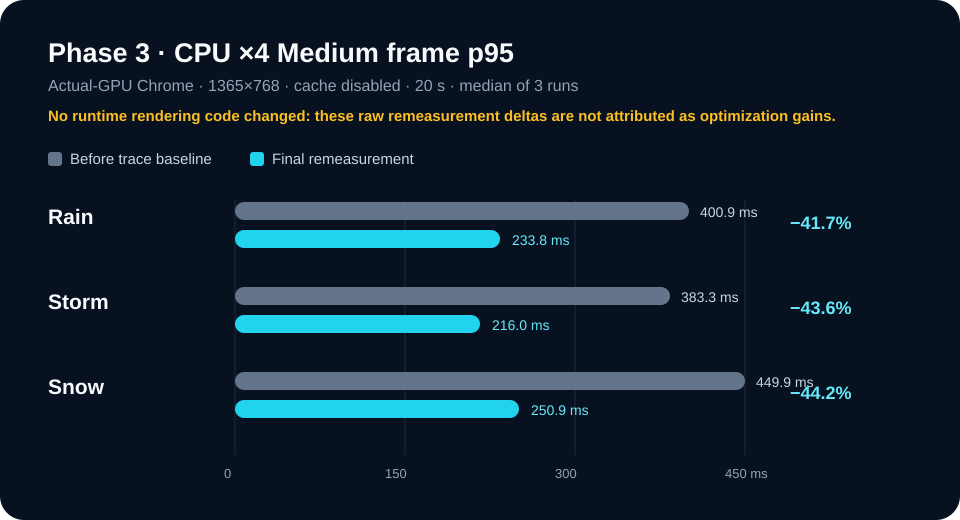

# Phase 3 최종 비교

## 결론

**안전한 렌더링 개선은 확정하지 못했다.** PR #29의 실제 GPU trace에서 CPU ×4 Medium Rain/Storm/Snow 모두 단일 1.5배 병목 기준을 충족하지 못해, PR #30에서 런타임 코드를 변경하지 않았다. 따라서 목표였던 “코드 최적화로 각 15% 개선”은 **미시도/미확정**이며, High 시각 품질도 변경하지 않았다.

최종 재측정은 이전보다 낮은 raw p95를 보였지만, 비교 사이에 렌더링 코드가 전혀 바뀌지 않았다. 이 차이는 환경·브라우저 스케줄링 변동으로 기록하며 최적화 효과로 주장하지 않는다.

## CPU ×4 · Medium · frame p95

| 프리셋 | Before 3회 → 중앙값 | After 3회 → 중앙값 | 절대 차이 | raw 개선율 | 15% 수치 임계 | 최종 판정 |
| --- | ---: | ---: | ---: | ---: | --- | --- |
| Rain | 417.5 / 400.9 / 400.0ms → **400.9ms** | 249.0 / 165.9 / 233.8ms → **233.8ms** | 167.1ms 단축 | 41.7% | raw 기준 통과 | **미확정** — 코드 변경 없음 |
| Storm | 383.3 / 383.2 / 500.0ms → **383.3ms** | 299.4 / 117.3 / 216.0ms → **216.0ms** | 167.3ms 단축 | 43.6% | raw 기준 통과 | **미확정** — 코드 변경 없음 |
| Snow | 449.9 / 533.3 / 383.4ms → **449.9ms** | 250.0 / 300.0 / 250.9ms → **250.9ms** | 199.0ms 단축 | 44.2% | raw 기준 통과 | **미확정** — 코드 변경 없음 |

이 표의 raw 변화는 숨기지 않지만, Phase 3 런타임 커밋은 0개다. 그러므로 ‘개선율’ 열은 재측정 차이이며 최적화 성과가 아니다.

## Desktop · High · frame p95 (시각 품질 기준)

| 프리셋 | Before 중앙값 | After 3회 → 중앙값 | 절대 차이 | raw 개선율 | 판정 |
| --- | ---: | ---: | ---: | ---: | --- |
| Rain | 166.7ms | 83.3 / 83.3 / 67.2ms → **83.3ms** | 83.4ms 단축 | 50.0% | 코드·High 시각 품질 변경 없음. 인과적 개선 아님 |
| Storm | 182.7ms | 66.7 / 83.3 / 83.4ms → **83.3ms** | 99.4ms 단축 | 54.4% | 코드·High 시각 품질 변경 없음. 인과적 개선 아님 |
| Snow | 166.7ms | 83.3 / 83.4 / 85.3ms → **83.4ms** | 83.3ms 단축 | 50.0% | 코드·High 시각 품질 변경 없음. 인과적 개선 아님 |

## 병목 판정 근거

| CPU ×4 · Medium | 초기 trace 최대 / 2위 | 비율 | 최종 trace 최대 / 2위 | 비율 | 판정 |
| --- | --- | ---: | --- | ---: | --- |
| Rain | Composite / JavaScript | 1.04× | Composite / JavaScript | 1.04× | unclassified |
| Storm | Composite / JavaScript | 1.04× | Composite / JavaScript | 1.04× | unclassified |
| Snow | Composite / JavaScript | 1.01× | JavaScript / Composite | 1.00× | unclassified |

모든 값은 포함 관계가 가능한 trace 이벤트 집계다. 1.50× 이상인 단일 우세 비용이 없으므로 JS/Canvas, Paint/Raster/Composite, Cesium 중 어느 경로도 안전한 공통 변경 대상으로 확정하지 않았다.

## 기능·시각 검증

| 검증 | 결과 | 근거 |
| --- | --- | --- |
| High 시각 품질 | 통과 | High 렌더링 프로필·입자·해상도 코드를 변경하지 않음, High Rain/Storm/Snow 캡처 보존 |
| Medium / Low 시각 프리셋 | 통과 | 각 Rain/Storm/Snow 독립 캡처 6개 보존 |
| 지역 변경·Weather 캐시·강제 새로고침 | 통과 | Playwright E2E 7개 통과 |
| 시간 슬라이더·카메라·품질 저장/복원·탭 복귀 | 기존 단위/E2E 범위 통과 | 단위 256개 및 Dashboard 품질 저장 E2E 통과 |
| 정적 예산 | 통과 | JS gzip 86,752B ≤ 92,160B, CSS gzip 14,947B ≤ 18,432B, dist 13,534,839B ≤ 14,292,091B, thumbnail 213,019B ≤ 256,000B |

## 원본과 재현성

- 초기 기준선: [`runs/render-trace-after.json`](runs/render-trace-after.json)
- 최종 결합 원본: [`runs/final-after.json`](runs/final-after.json)
- 최종 분리 원본: [`runs/`](runs/)의 `final-after-*.json` 6개
- 최적화 미시도 판정: [`changes/final-render-optimization.md`](changes/final-render-optimization.md)
- 측정 환경과 한계: [`measurement-protocol.md`](measurement-protocol.md)
